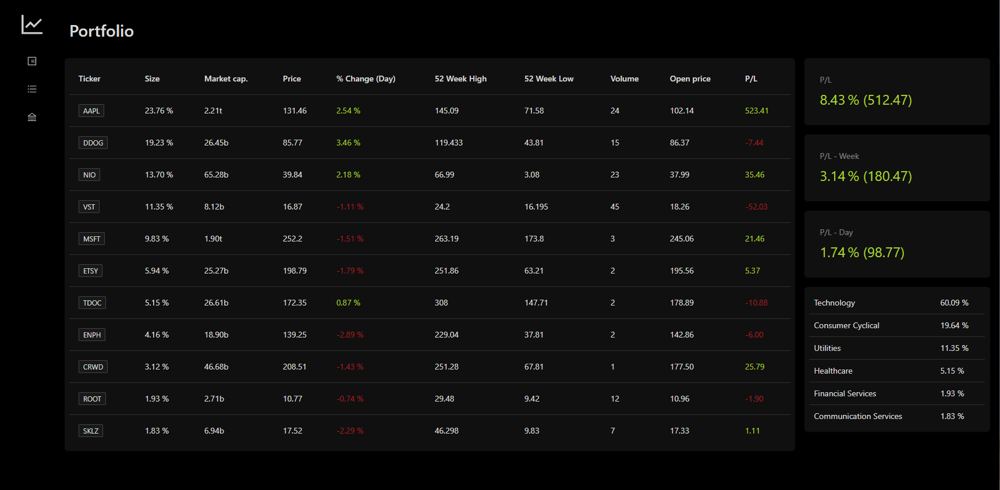
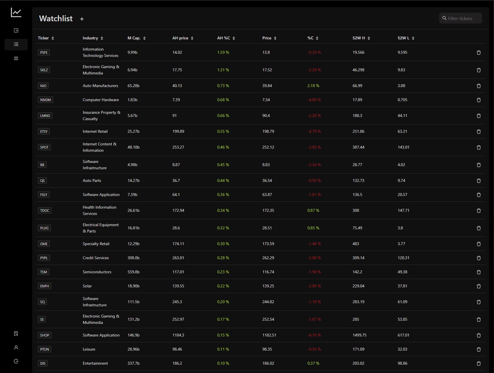
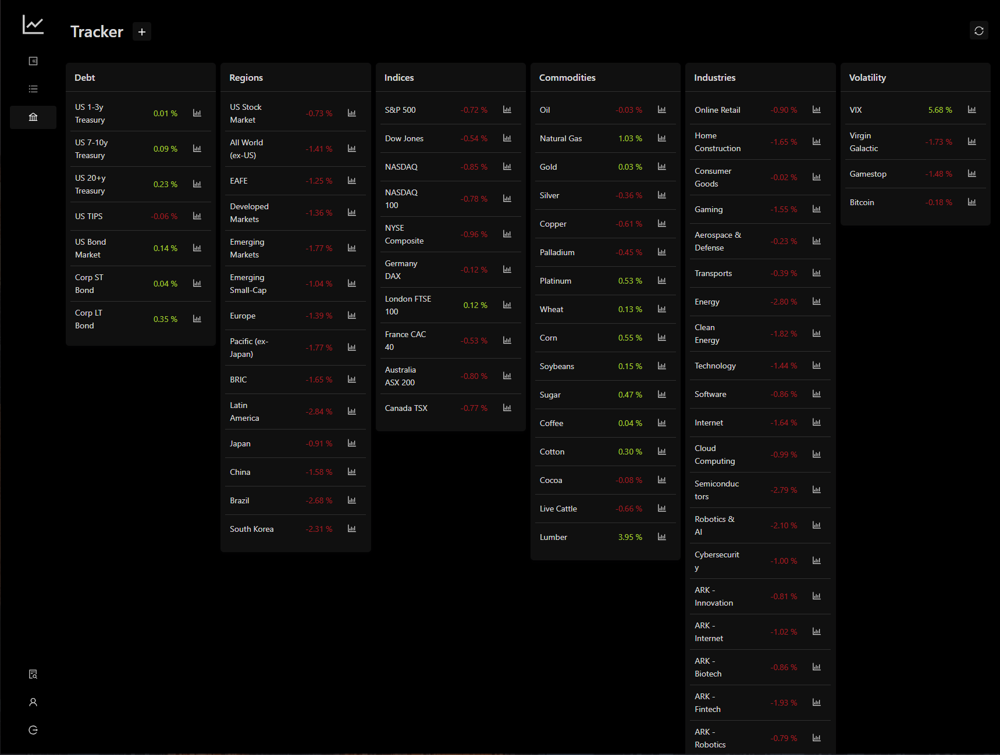
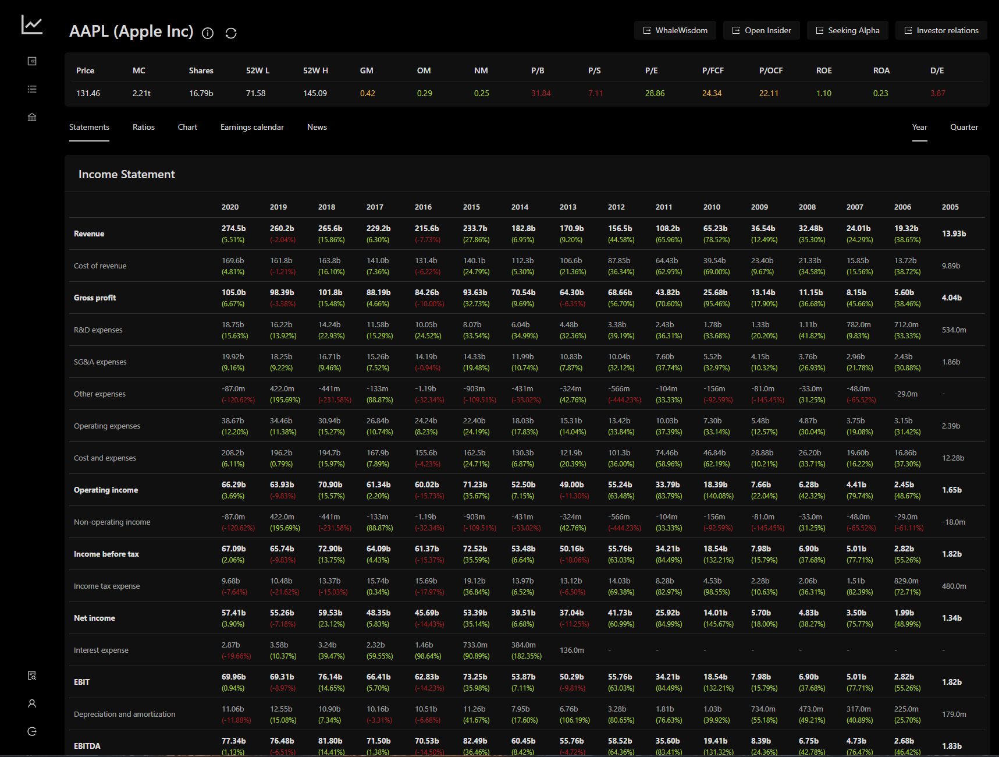
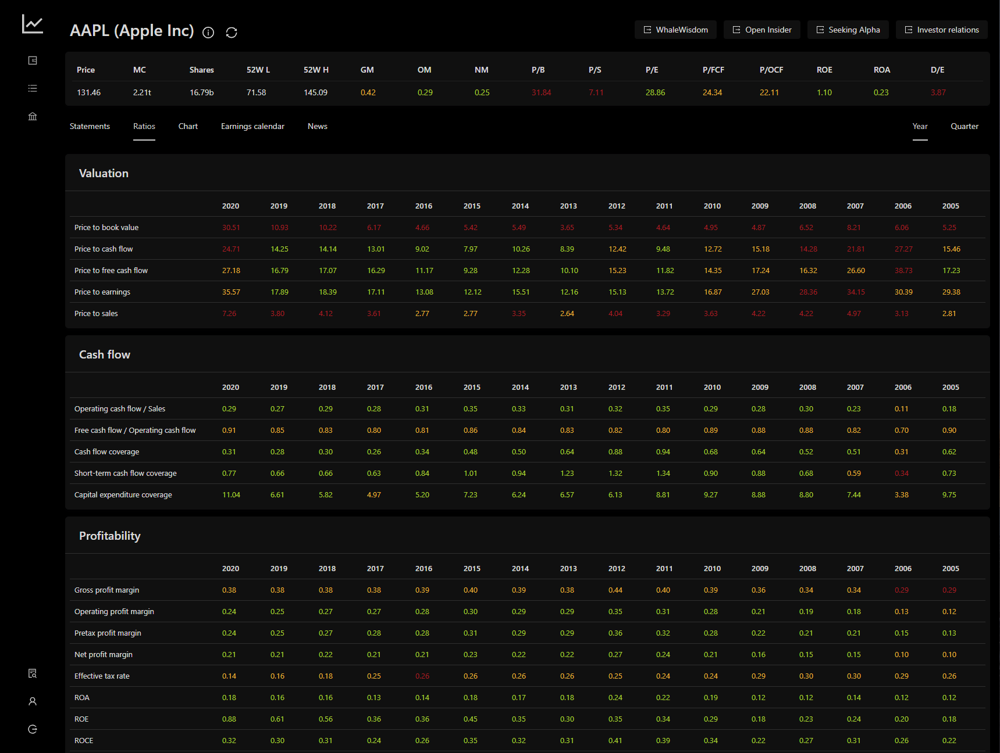
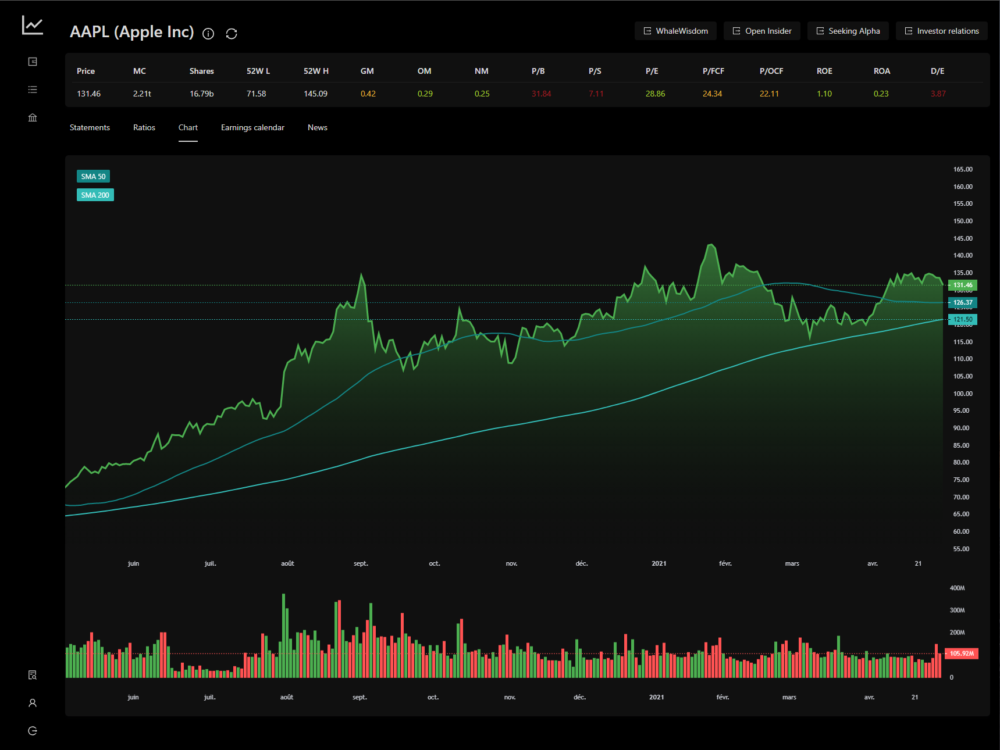
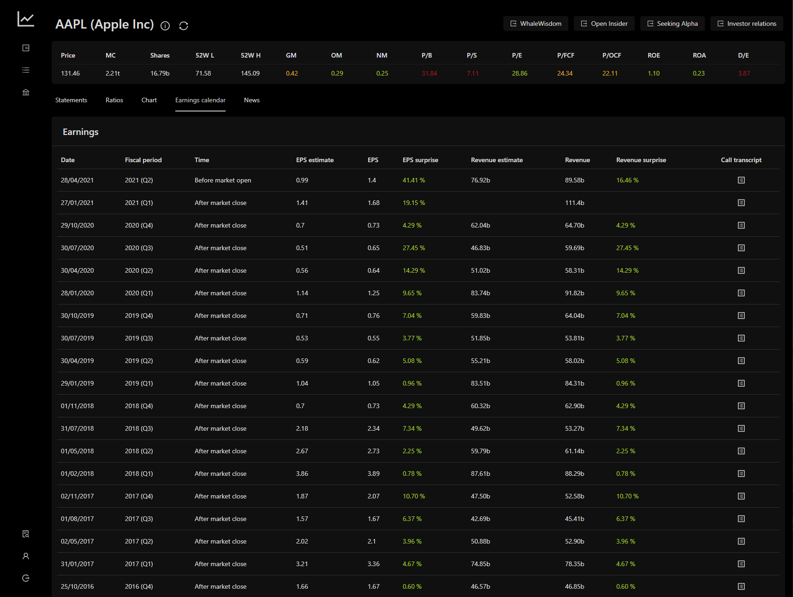
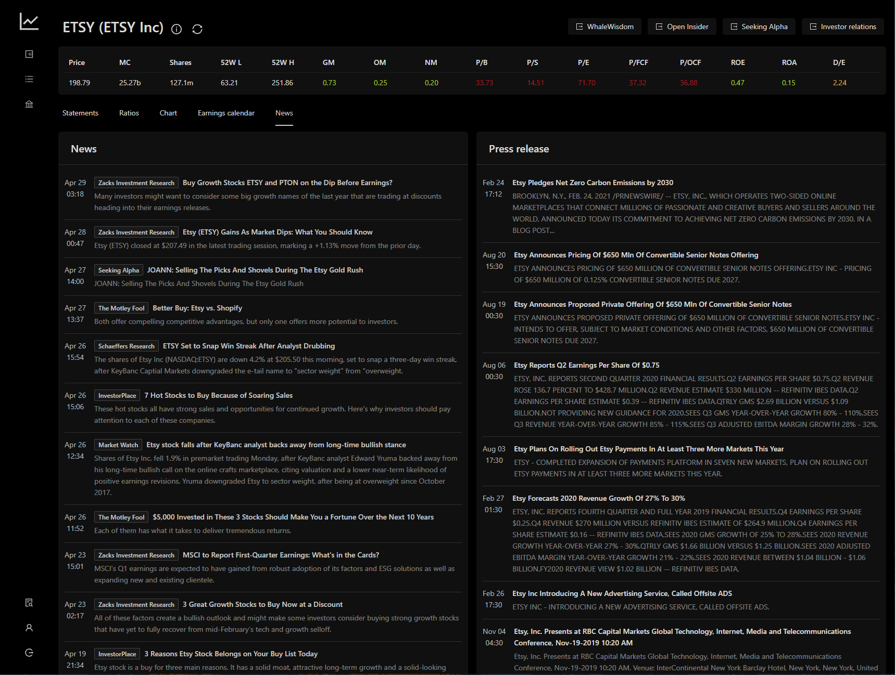

## About the project

--

## Disclaimer

This project is still under heavy development, some features might not work as intended

## Getting started

### Install

#### Docker (preferred)

Use the docker-compose example [here](./examples/docker-compose)

#### Manual

--

#### Create users

Retrieve the `adduser.sh` file [here](./examples/adduser.sh)

````shell
chmod +x adduser.sh
ENDPOINT=https://example.com/graphql USERNAME=foo PASSWORD=s3cr3t ./adduser.sh
````

`ENDPOINT` should be the same value as the `ENDPOINT` variable defined in your `.env` file suffixed with `/graphql`

## Features

### Portfolio (Real time)



### Watchlist (Real time)



### Trackers



### Security detail

#### Financials (15 years / quarters)



#### Ratios (15 years / quarters)



#### Chart

Historical prices (Day period) (End of day refresh)



#### Earnings



#### News



## Data sources

- FMP (https://financialmodelingprep.com/developer)
- Macrotrends (https://www.macrotrends.net/)
- Yahoo finance (https://finance.yahoo.com/)

## License

GPL-3.0 License. See [LICENSE](https://github.com/fcote/merlin/blob/dev/LICENSE) for more information.
